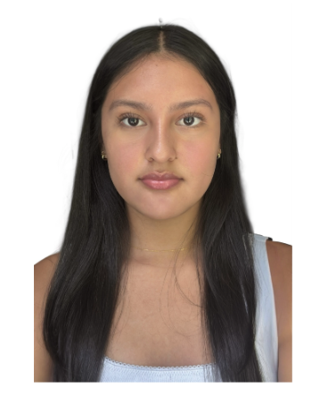
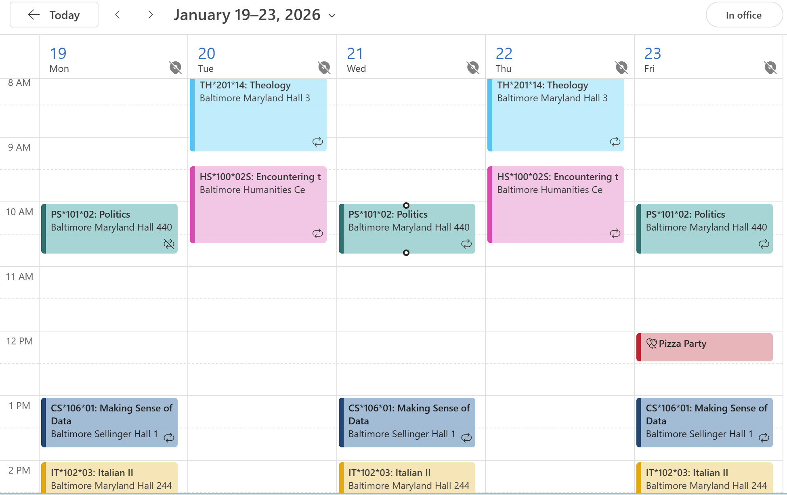
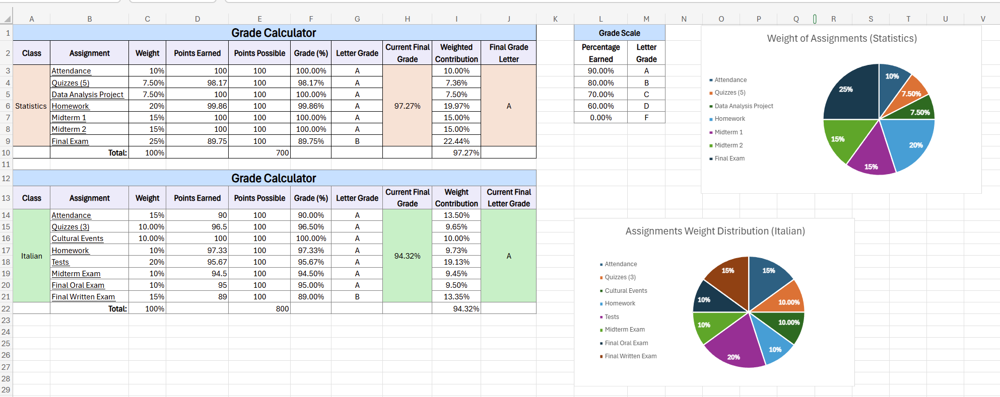
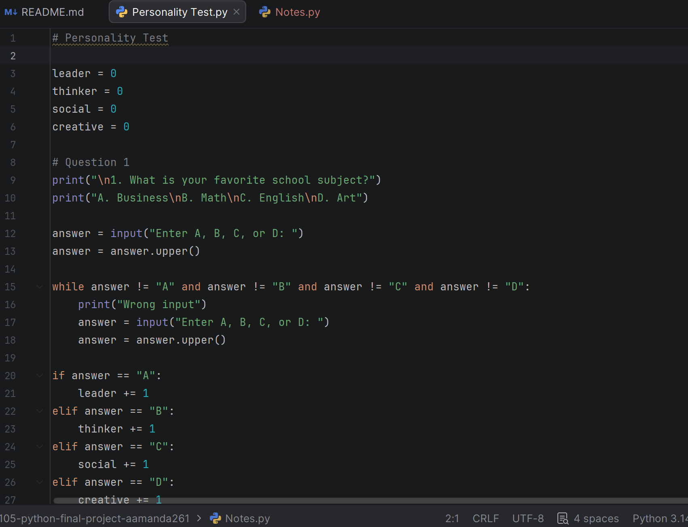

# CS105/6/7/8 Portfolio

# Amanda Flores
## Portfolio
Contact Info: avfloresgonzalez@loyola.edu
## About Me 
Hello! I am a student at Loyola University Maryland studying Political Science. I am building skills in Excel, Python, and data analysis through hands-on projects.

I enjoy solving real-world problems, such as creating tools to track grades and developing interactive programs. I am familiar with Microsoft Excel, PyCharm, and Microsoft Outlook.

I am motivated to continue learning and improving my technical skills. In my spare time, I like to spend time with my family and make pottery.

### Education 
Freshman Student, Political Science,
Loyola University Maryland

***
## Projects

## Weekly Schedule Calender
[Link to Project](https://outlook.office.com/calendar/view/workweek)

 - I created a weekly calendar using Microsoft Outlook with a color-coded system to organize classes and events. This helped me organize my schedule and improve time management. I designed a color-coding system to clearly separate classes and events. A challenge was choosing an effective color system, which I solved by assigning consistent colors to each class. The final result is a clear and organized schedule, and I would expand it by adding more events and reminders.

***
## Grade Calculator (Excel)

[Link to Project](https://studentsloyola-my.sharepoint.com/:x:/g/personal/avfloresgonzalez_loyola_edu/IQC9J-zgDCe4Sr871qBtUpa2AdX54NesaKnde4seMEWBpxo?e=8gaeSC)

 
 - I created a grade calculator to solve the problem of tracking and predicting final grades across multiple classes. I used Microsoft Excel with formulas and conditional formatting to automate calculations and display letter grades. One challenge I faced was setting up the formulas correctly, which I solved by testing and adjusting them. I used class materials and online resources to guide me. The final result was a working tool that updates grades automatically, and in the future I would improve the design and add more features.

***
##  Personality Test Application (Python)

[Link to Project](https://github.com/LoyolaUnivMD/sp26-cs105-python-final-project-aamanda261/blob/main/Personality%20Test.py)

 - I developed a personality test to simulate how quizzes assign personality types based on user responses. I used Python in PyCharm and implemented loops, conditionals, and a scoring system. A challenge I faced was handling invalid user input, which I solved using input validation and loops. I used class notes and examples to help guide my coding. The final program successfully assigns personality types, and I would improve it by adding more questions and enhancing the interface.

